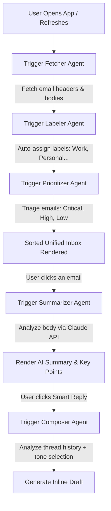

# 🌌 NeuralMail – AI-First Universal Email Client PWA

NeuralMail is a next-generation, premium universal email client designed for the mobile-ready Progressive Web App (PWA) era. Built on **Agent OS Methodology**, it orchestrates **six autonomous agents** working in parallel to fetch, sort, prioritize, summarize, and draft emails from multiple providers including Gmail, Outlook, Yahoo, and AOL.

---

## 🏗️ System Architecture

NeuralMail utilizes a modular, layer-separated architecture allowing rapid multi-agent collaboration with a decoupled frontend interface.

```
┌──────────────────────────────────────────────────────────┐
│                   Frontend (React PWA)                   │
│   • Dark HSL Glassmorphism UI   • Offline Caching       │
│   • Adaptive Compose Modal      • Live Agent Status Bar  │
└──────────────────────────┬───────────────────────────────┘
                           │  REST / Event Emitters
┌──────────────────────────▼───────────────────────────────┐
│              Multi-Agent Orchestrator (Agent OS)          │
│   • Coordinates 6 Autonomous Pipeline Agents             │
│   • Manages Event Hooks (beforeSend, afterFetch...)     │
│   • Triggers Async Provider Plugins                      │
└──────────────────────────┬───────────────────────────────┘
                           │  Data Pipeline Flow
┌──────────────────────────▼───────────────────────────────┐
│                     Active Provider Plugins              │
│   • Gmail OAuth2   • Office 365   • Yahoo IMAP   • AOL   │
└──────────────────────────────────────────────────────────┘
```

---

## 🤖 The 6-Agent Framework

Every process inside NeuralMail is driven by specialized, pure agents operating asynchronously:

| Agent Name | Primary Responsibility | Input Payload | Output Result |
| :--- | :--- | :--- | :--- |
| **📧 EmailFetcher** | Retrieves raw emails across all authenticated mailboxes | `accountId` | Array of raw `Email` items |
| **🎯 Prioritizer** | Performs AI triage scoring based on urgency & blocking criteria | Array of `Email` | Ranks and re-sorts emails |
| **✨ Summarizer** | Runs LLM summaries, extracts action points, and read times | Single `Email` | Pre-calculated `AIInsights` |
| **✍️ Composer** | Generates context-aware replies matching user tone selectors | `Email` + Tone | Auto-populated draft string |
| **🔍 Searcher** | Executes local/semantic query indexing over active datasets | query string | Filtered match collections |
| **🏷️ Labeler** | Classifies content categories dynamically | `Email` body | Category strings (Work, Personal...) |

---

## 🔄 Agentic Flow Algorithm (Step-by-Step)

Here is exactly how the multi-agent pipeline works when you load and interact with your inbox:



### 1️⃣ Step 1: Ingestion (EmailFetcher & Labeler)
* The **Fetcher Agent** authenticates via active provider plugins (like Gmail OAuth or IMAP).
* It downloads email headers, attachments, and snippets in parallel.
* Once retrieved, the **Labeler Agent** instantly scans terms to assign folders and standard labels.

### 2️⃣ Step 2: Intelligent Triage (Prioritizer)
* Raw emails are sent to the **Prioritizer Agent**.
* It computes an importance rating (Critical, High, Medium, Low, Promotional) by analyzing sender, deadlines, blocking actions, and recipient status.
* The inbox is instantly rendered with **Critical** items pinned at the top.

### 3️⃣ Step 3: Synthesis (Summarizer)
* When you open an email, the **Summarizer Agent** is invoked.
* It leverages Claude to generate a 1-sentence headline summary, extracts exact bulleted action items, estimates read-time, and flags if immediate attention is required.

### 4️⃣ Step 4: Generation (Composer)
* Clicking **"Smart Reply"** triggers the **Composer Agent**.
* It takes the email context, sentiment, and your selected tone (`Formal`, `Casual`, `Brief`) to write a contextually accurate reply in seconds.

---

## 🛠️ How to Run & Work With the Code

### 💻 Running Locally

Since you have successfully run `npm install`, you are ready to start:

```powershell
# Start the local development server
npm run dev
```

* This runs the server on **`http://localhost:5173`**.
* The **Agent Status Bar** at the bottom of the UI will light up to display real-time statuses (`idle`, `running`, `done`) as the agents communicate!

### 🧪 Running Unit Tests

We have written rigorous test suites for all 6 agents to ensure complete reliability:

```powershell
npm run test
```

### 🌐 Deploying Live to Vercel

To launch the client publicly on Vercel:

```powershell
# Trigger our automated deploy pipeline batch script
.\DEPLOY.bat
```

---

## 📝 Project Discipline (CLAUDE.md)
Always follow the standards defined in `CLAUDE.md`:
* **Types First**: Declare all model states in `src/types/index.ts` first.
* **Pure Agents**: Keep agent functions side-effect-free (return `{ success, data, duration }`).
* **Event Hooks**: Use Hooks (`beforeSend`, `afterFetch`) for logging and auditing.
